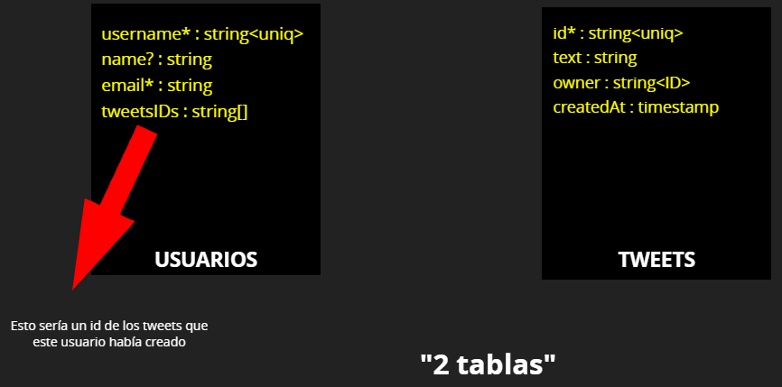

# Primera API con 2 recursos

Queremos desarrollar una api restful con node para un proyecto copia de twitter. Aunque de momento, será solo una primera versión con usuarios y tweets como si fuese un blog personal.



## Parte 1: Direccionamiento Express
Deberán estar implementadas las funcionalidades de:

Usuarios:
- [x] Crear un nuevo usuario (POST)
- [x] Borrar un usuario (DELETE)
- [x] Editar el email de un usuario o el nombre (PATCH)

Tweets:
- [x] Subir un tweet nuevo por parte de un usuario
- [x] Ir a buscar un tweet en concreto por su id
- [x] Borrar un tweet por su id

Opcional
- [x] Opcional: Obtener todos los tweets ordenados tanto asc como desc por la fecha de subida
- [x] Opcional: Guardar los usuarios en un fichero db.json y actualizarlo con cada cambio.
- [x] Opcional: Guardar los tweets en un fichero db.json y actualizarlo con cada cambio.
- [x] OBLIGATORIO: Usar router para cada recurso

OJO: CONTROLAR QUE LA API NO SE PUEDA QUEDAR PILLADA EN NINGÚN MOMENTO, controla campos vacíos, request inválidas, etc etc y devuelve el error en la respuesta y el código correcto para dicho caso.

## Parte 2: Middlewares

El producto evoluciona

Oye, que me han dicho que ahora sabes usar middlewares, pues mira, estaría interesante que : 

- Cuando se produzca un error en nuestra api le llegue un correo al desarrollador con el error.
- También estaría chulo que si un usuario nos hace más de 20 peticiones POST en una misma sessión no le permitas hacer más peticiones post y nos informes por correo también.
- Hemos visto que hay muchas herramientas para monitorizar logs por ahí :S Investiga e implementa alguna para controlar todo lo que pasa en nuestro server de express [https://www.slant.co/options/955/alternatives/~loggly-alternatives](https://www.slant.co/options/955/alternatives/~loggly-alternatives)

## Parte 3: Conexión a MongoDB

Guardar los datos del proyecto en mongoDB usando mongoose para conectar nuestra API con la base de datos

- [ ] R1. Usuarios
    - [x] Definir Schema
    - [x] Implementar CRUD de users

    ```javascript
    /**
     * GET      /api/users                      -> getAll
     * POST     /api/users                      -> create
     * PATCH    /api/users/:username            -> modify
     * PUT      /api/users/:username            -> update
     * DELETE   /api/users/:username            -> destroy
    */
    ```

    - [x] Validaciones con mongoose

- [ ] R2. Tweets 
- [x] Definir Schema
    - [x] Implementar CRUD de users

    ```javascript
    /**
     * GET      /api/tweets                      -> getAll
     * POST     /api/tweets                      -> createTweet
     * GET      /api/tweets/:id                  -> getTweet
     * DELETE   /api/tweets/:id                  -> deleteTweet
    */
    ```

    - [x] Validaciones con mongoose
## Parte 4: Mejoras 

1. Aplicar paginación a la API
    * queryParams: [vídeo](Path vs Query Parameters in HTTP Requests (with Postman))
    * Investigar como páginar una búsqueda de mongoose
    * Investigar tanto el `limit` como el `skip` y parametrizarlo

2. Frontend
    * Realizar un frontal para nuestro proyecto
